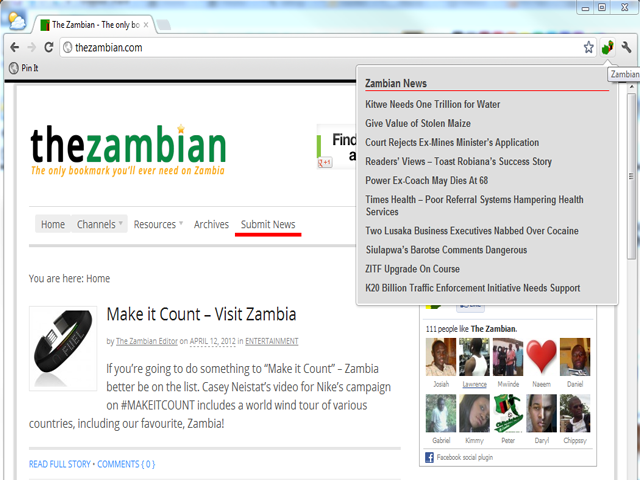

# TU Guide

A lightweight Chrome extension for Temple University users.

TU Guide adds quick **directory lookups** from selected text and provides a popup with the latest **Temple campus news**.

## Table of contents
- [Features](#features)
- [Screenshots](#screenshots)
- [Install](#install)
- [Usage](#usage)
- [Tech stack](#tech-stack)
- [Development](#development)
- [Testing](#testing)
- [Packaging for release](#packaging-for-release)
- [Security & privacy](#security--privacy)
- [Roadmap](#roadmap)
- [Contributing](#contributing)
- [License](#license)

## Features

- **Context menu directory search** for selected names:
  - Last name lookup
  - First name lookup
- **Popup news feed** from Temple's official campus-news RSS endpoint
- **Options page** with extension metadata and quick navigation
- **Manifest V3-first** architecture with least-privilege permissions

## Screenshots

| Popup | Options |
|---|---|
|  |  |

## Install

### Option A: Load unpacked (local development)

1. Clone this repository.
2. Open `chrome://extensions`.
3. Enable **Developer mode**.
4. Click **Load unpacked** and choose the repo folder.

### Option B: Chrome Web Store

Use the published store listing for production installs (maintainer release process is documented below).

## Usage

1. Highlight a name on any webpage.
2. Right-click and choose:
   - **Last Name Lookup** or
   - **First Name Lookup**
3. Click the TU Guide extension icon to open the news popup.
4. Open **Options** from the context menu to view extension info.

## Tech stack

- **Browser extension platform**: Chrome Manifest V3
- **Runtime**: vanilla JavaScript + HTML/CSS
- **Tests**: Node.js test runner + Playwright smoke coverage
- **Tooling**: ESLint + Prettier

## Development

### Prerequisites

- Chrome (latest stable)
- Node.js 18+
- npm

### Setup

```bash
git clone <repo-url>
cd tuguide
npm install
```

### Run locally

Load the extension unpacked via `chrome://extensions`.

## Testing

```bash
# Unit tests
npm run test:unit

# Static checks
npm run lint
npm run format:check

# Security/compliance checks
npm run validate:manifest
npm run scan:policy

# End-to-end smoke test (Chromium runtime required)
npm run test:e2e
```

## Packaging for release

Create a distributable zip from the repo root:

```bash
rm -rf dist
mkdir -p dist
zip -r dist/tuguide-v<version>-unsigned.zip manifest.json background.js news.html options.html js css images LICENSE README.md docs
```

Replace `<version>` with the exact version in `manifest.json`.

For update channel details and rollback notes, see `docs/update-channels.md`.

## Security & privacy

TU Guide is designed with minimal data access:

- Uses `contextMenus` permission for user-invoked directory actions
- Requests a single host permission for Temple campus-news RSS
- Does **not** collect analytics or telemetry
- Does **not** store browsing history or personal data
- Uses hardened CSP and avoids remote script execution

See `docs/permissions.md` for policy and listing language.

## Roadmap

- Improve popup resilience and empty/error states
- Expand automated smoke checks
- Evaluate cross-browser packaging strategy where appropriate

## Contributing

Contributions are welcome.

1. Create a branch.
2. Make your changes.
3. Run tests/checks.
4. Open a PR with a clear summary and validation output.

## License

Licensed under the terms in [`LICENSE`](LICENSE).
